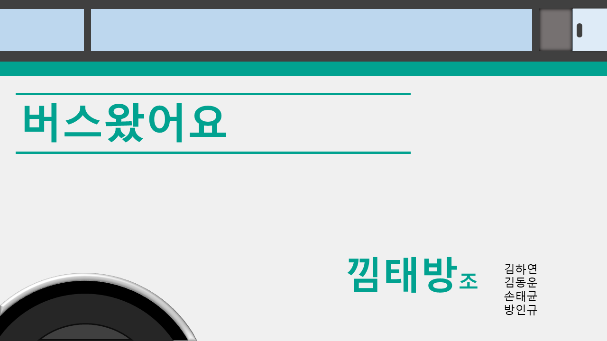
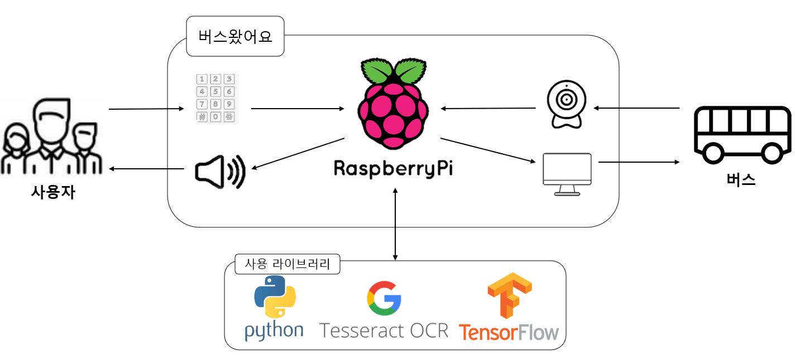
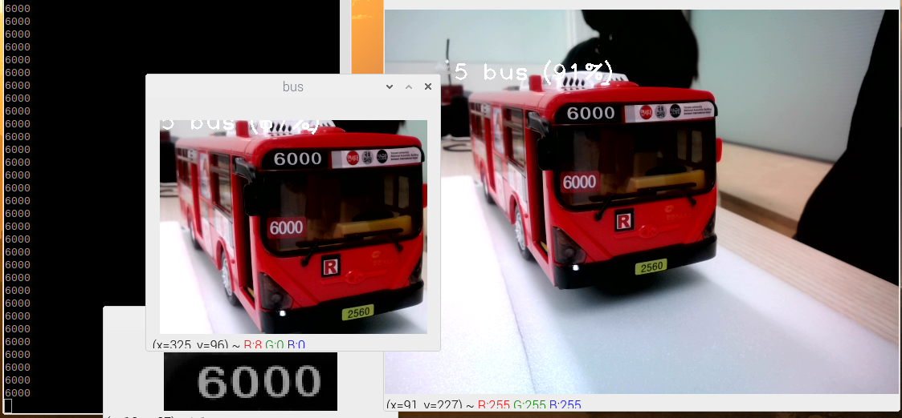
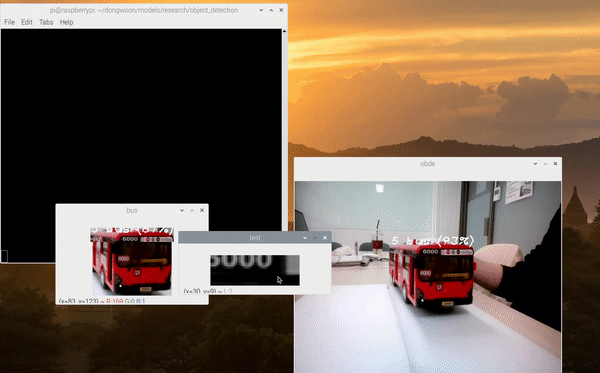

# ✨시각장애인을 위한 버스도착 알림 장치✨  

   

## 👀개요  

- 현대 사회에서 대중교통 위치 정보를 이용하여 사람들이 간단하게 이용할 대중교통의 정보를 얻고 쉽게 대중교통을 이용할 수 있다. 
- 해당 정보는 각종 어플리케이션과 대중교통 이용시설에서 위치 정보를 제공하고 있지만 시각장애인에게 이러한 서비스는 이용함에 있어 애로사항이 많다. 
- 본 프로젝트에서는 대중 교통 중 버스에 대해 다루며 버스 정류장에 영상분석을 통해 버스의 도착여부를 알리는 설치형 버스 도착 알림 시스템을 제안한다. 
- 제안한 시스템을 활용하여 시각장애인들이 버스 이용에 더욱 높은 접근성과 편리함을 갖춘 서비스를 제공할 수 있기를 기대한다.  

   

## ⚙기술스택  

    
   
## 📈구성도 (아키텍처)  

## 🖥데모  
  
- obde , ocr 인식  

  
- 시연 장면  

  
- 시연 화면  

 

## 👋팀 소개  
- 팀명 : 낌태방
- 팀장 : 김하연
- 팀원 : 김동운 , 손태균 , 방인규  
- 역할  

|메인|OBDE|OCR|TTS|
|---|---|---|---|
|방인규|김동운|손태균|김하연|
